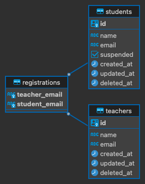

# Fabian Chua - Govtech OneCV Assessment

## Self Introduction 👋🏼

Hi, I'm Fabian Chua, a Year 3 Software Engineering undergraduate from SIT. My past experiences includes interning at Accenture as a Front End Engineer Intern as well as GovTech as a Delivery Manager Intern. More about me on my [LinkedIn](https://www.linkedin.com/in/fabianchua6/) and [personal website](https://www.fabianchua.com/).

## Table of Content

- [Getting Started](#getting-started)
  - [Tech Stack](#tech-stack)
- [Installation 🔨](#installation-)
  - [Prerequisites](#prerequisites)
  - [Configurations](#configurations)
  - [Database Setup 💿](#database-setup-)
  - [Server Setup 🖥️](#server-setup-️)
    - [Preliminary Steps](#preliminary-steps)
    - [Detailed Steps](#detailed-steps)
- [API Testing with Postman 🧪](#api-testing-with-postman-)
  - [Importing the Postman Collection](#importing-the-postman-collection)
  - [Using the Collection](#using-the-collection)
- [Further Improvements 🧐](#further-improvements-)
- [Reference materials](#reference-materials)

## Getting Started

### Tech Stack

The assignment is to build an API application using Go and PostgreSQL. Below outlines the tech stack used and how the repository is organized.

- **Backend**: [Golang](https://golang.org/)
- **Web Framework**: [Gin](https://github.com/gin-gonic/gin)
- **ORM**: [GORM](https://gorm.io/)
- **Database**: [PostgreSQL 13+](https://www.postgresql.org/)
- **Architecture**: [Model-View-Controller (MVC)](https://en.wikipedia.org/wiki/Model%E2%80%93view%E2%80%93controller)

The repository is structured as such:

```bash
├── config           # Database configurations and initializations
│   └── db.go        
├── controllers      # Request handling and response sending
│   ├── error_controller.go
│   ├── registration_controller.go
│   ├── student_controller.go
│   └── teacher_controller.go
├── models           # Data models and database schema
│   ├── registration_model.go
│   ├── student_model.go
│   └── teacher_model.go
├── .env.example     # .env example file
├── dbSetup.sql      # Database setup file
├── go.mod           # Go module file
├── go.sum           # Checksums for go.mod
└── main.go          # Entry point for the application
```

## Installation 🔨

 This `README` assumes that the reader has basic familiarity with git, Go and Postgres

To get your development environment set up, you'll need to fork the repository and clone it locally. After that's done, you can proceed with the following configuration and installation steps to get the API up

### Prerequisites

- Golang version 1.16 and above
- PostgreSQL version 13 and above

> For installation instructions check out the official documentation for [Golang](https://golang.org/doc/install) and [PostgreSQL](https://www.postgresql.org/download/).
>
### Configurations

1. Duplicate the `.env.example` file, rename to .env and populate it with your credentials for local development.

2. Create the required schema and seed initial data using the `dbSetup.sql` file.

### Database Setup 💿

**ER Diagram:**



1. **Set Credentials:** Create your `.env` file from `.env.example` and set your Postgres database credentials. The `.env` file should look something like this

```bash
# .env file
APP_ENV=your_app_environment_here
DB_HOST=your_db_host_here
DB_PORT=your_db_port_here
DB_USER=your_db_username_here
DB_PASSWORD=your_db_password_here
DB_NAME=your_db_name_here
DB_SSLMODE=your_db_sslmode_here
```

2. **Start PostgreSQL Instance:** Spin up your PostgreSQL instance running on port 5432.

```bash
# check if postgresql is installed and the version
psql --version
```

```bash
# start postgresql instance
sudo service postgresql start #for MacOS/Linux
pg_ctl -D /usr/local/var/postgres start # for windows

# connect to postgresql instance
psql postgres -U postgres # for MacOS/Linux
psql -U postgres # for windows
```

3. **Database Creation:** Create a database named `SchoolDB`
4. **Run SQL Script:** Run `dbSetup.sql` query to create the necessary tables and seed initial data.
5. **Test Connection:** Execute simple SELECT queries to ensure that tables are populated.

```sql
SELECT * FROM teacher;
```

### Server Setup 🖥️

After setting up the database, you'll need to configure and run the server.

#### Preliminary Steps

1. **Check Go Version**: Ensure you're using Go 1.16 or above by running `go version`.

2. **Environment Variables**: Make sure your `.env` file in the `backend` directory is properly set up with your own variables (Refer to [Configurations](#configurations)).

#### Detailed Steps

1. **Download Project's Dependencies**:

    ```bash
    go mod tidy
    ```

    Run `go mod tidy` to fetch the required dependencies. This ensures that all dependencies are downloaded in order to run the server.

2. **Start the Server**:

    ```bash
    go run main.go
    ```

    This command starts the server. You should see output indicating that the server is running, typically on port 8080.

3. **Verify Installation and Functionality**:
    - **Using Postman**: Open Postman and send a GET request to the following `http://localhost:8080/api/teacher` a JSON of teachers will return if it is working.
    - **Using Curl**: Alternatively, you can run the following curl command in the terminal:

    ```bash
    curl http://localhost:8080/api/teacher
    ```

## API Testing with Postman 🧪

In this repository also includes the Postman collection I have used to test the API endpoints. The collection contains pre-configured API requests that cover covers the user stories and other basic calls. To use the Postman collection, follow these steps:

### Importing the Postman Collection

1. **Download and Install Postman**: If you don't already have Postman installed, download it from [here](https://www.postman.com/downloads/).

2. **Locate the Collection**: In the repository, there is a file  `gt-onecv.postman_collection.json`

3. **Import file into Postman**:
    - Open Postman.
    - Locate the `Import` button at the top left corner.
    - Click it and then choose the `gt-onecv.postman_collection.json` file to import.

### Using the Collection

1. **Configure Environment Variable**: After populating the `.env` file with your local development credentials, make sure to check if it is the same in the Postman environment for ease of use. There is only one environment variable, where `{{dev_url}}` = `localhost:8080`

2. **Run Requests**: Once imported, you'll see a folder named `User Stories` in your Postman sidebar. Click on it to expand and reveal all 4 user stories to be tested. The other folders are routes that are not part of the user stories but are included for testing purposes.

3. **Execute**: To test an API endpoint, simply click on a request and then hit the `Send` button.

## Further Improvements 🧐

- [ ] Frontend Implementation 🎨
- [ ] Hosting the application ☁️
- [ ] Containerising the application 🫙
- [ ] CI/CD pipeline 🔄

## Reference materials

- [Building a simple app with Go and PostgreSQL](https://blog.logrocket.com/building-simple-app-go-postgresql/
)
- [Postgres With GO - Using GORM [Youtube Playlist]](
https://www.youtube.com/watch?v=R5KiqmsMysM&list=PL5dTjWUk_cPaKHFvmMct_VG5vIU4piYv4)
